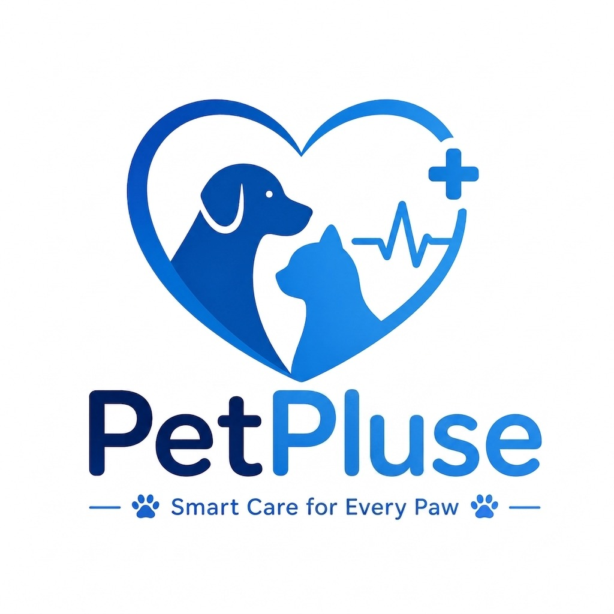
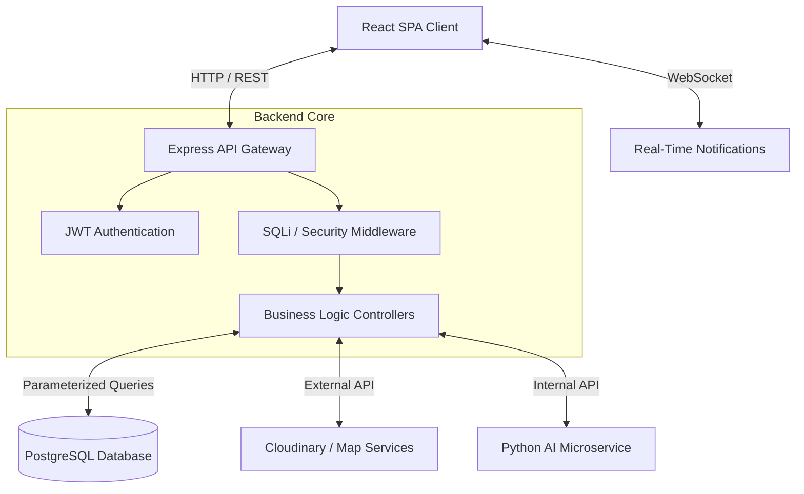

<div align="center">
  
</div>

<h1 align="center">🐾 PetPulse (Mewoo)</h1>

<div align="center">
  
  
  
  
  
</div>

<p align="center">
  <strong>The Ultimate Ecosystem for Pet Owners, Veterinarians, and Professional Trainers</strong><br>
  <em>A Full-Stack Modern Web Application built for our Graduation Project</em>
</p>

---

## 📑 Table of Contents

- [📖 Abstract](#-abstract)
- [🚀 Key Features](#-key-features)
- [🛠️ Technology Stack](#-technology-stack)
- [🏗️ System Architecture](#-system-architecture)
- [🔒 Security Implementations](#-security-implementations)
- [🌐 REST API Endpoints](#-rest-api-endpoints)
- [⚙️ Getting Started (Local Development)](#️-getting-started-local-development)
- [🎓 Graduation Project Deliverable](#-graduation-project-deliverable)

---

## 📖 Abstract

**PetPulse (Mewoo)** is a comprehensive, AI-enhanced ecosystem designed to connect pet owners with verified local veterinarians, professional trainers, and an engaged community of pet lovers. By providing an integrated marketplace alongside health tracking and social community features, PetPulse centralizes the fragmented pet care industry into one beautiful, secure, and intuitive platform. 

This project was built from the ground up to showcase advanced modern web development practices, focusing heavily on interactive user interfaces, scalable backend architecture, and defense-in-depth security methodologies.

---

## 🚀 Key Features

- **Verified Professional Profiles**: Veterinarians and Trainers manage dynamic portfolios, accept reviews, and showcase certifications.
- **Intelligent Booking Ecosystem**: A complete booking, scheduling, and checkout pipeline utilizing a mock payment gateway integration.
- **Interactive Community Feed**: A real-time social feed where pet owners can share updates, ask questions, and engage with professional tips.
- **Pet Health & Identity Portfolios**: Comprehensive identity tracking for pets, including age, breed, weight, and vaccination histories.
- **Lost & Found Hub**: Rapid community-alert systems designed to safely recover lost pets via geolocation data.
- **Defense-in-Depth Security**: Fortified against top OWASP vulnerabilities, featuring parameterization, SQLi detection middleware, rate limiting, and Role-Based Access Control (RBAC).

---

## 🛠️ Technology Stack

| Layer | Technology | Description |
|-------|-----------|-------------|
| **Frontend** | React, Vite, TailwindCSS | High-performance Single Page Application (SPA) with a vibrant, fully responsive UI. |
| **Backend** | Node.js, Express.js | Highly scalable REST API serving robust data endpoints. |
| **Database** | PostgreSQL | Relational database handling complex joints and strict relational integrity. |
| **Authentication** | JWT, bcrypt | Stateless JWT Bearer tokens for secure, scalable session management. |
| **Integrations** | Cloudinary, Leaflet Maps | Secure media uploads and real-time mapping functionality. |
| **AI Capabilities**| Python Microservices | AI integrations running on port `5001` bridging machine-learning insights. |

---

## 🏗️ System Architecture

Our system uses a robust multi-layered architecture separating concerns effectively across the frontend, REST APIs, and database stores.



### 📁 Monorepo Structure

```text
Mewoo/
├── petpulse-web/        # [Frontend] React.js + Vite Application
│   ├── src/pages/       # UI Routes (Dashboard, Booking, Explore, Auth)
│   ├── src/components/  # Reusable UI elements (Navbar, Modals, Forms)
│   └── src/context/     # React Context for global auth & state
│
├── backend/             # [Backend] Node.js Express REST API
│   ├── server.js        # Core bootstrap and middleware configuration
│   ├── src/config/      # PostgreSQL connection pooling
│   ├── src/controllers/ # Business logic routing
│   ├── src/middlewares/ # Security (JWT verification, Input Validation)
│   └── scripts/         # Automated DB Migrations & Seeding
│
└── ai-services/         # [Microservices] Python-based AI triage models
```

---

## 🔒 Security Implementations

Security is treated as a first-class citizen in PetPulse. We have implemented 10 core security stories to defend against SQL Injection (SQLi) and authorization bypasses:

1.  **Parameterized Queries**: 100% of all PostgreSQL interactions utilize strict `$1, $2` parameterized bindings, neutralizing first-order SQL injection vectors.
2.  **Input Validation Middleware**: Every payload is sanitized and validated for proper types, lengths, and valid UUID formats before reaching the controller.
3.  **Active Threat Detection**: Proprietary middleware actively detects and blocks over 20 malicious SQLi patterns (e.g., `UNION SELECT`, `' OR 1=1`).
4.  **Least-Privilege Database User**: Application connections operate strictly on `SELECT, INSERT, UPDATE, DELETE`—with zero permissions for `DROP` or `ALTER`.
5.  **Rate Limiting**: Defends endpoints against brute-force attacks (e.g., 10 login attempts per 15 minutes).
6.  **Secure Headers**: Implemented via Helmet.js to prevent Cross-Site Scripting (XSS) and Clickjacking.

---

## 🌐 REST API Endpoints

Our scalable backend exposes multiple protected and public endpoints for client data consumption.

| Method | Endpoint | Auth Required | Description |
|--------|---------|:---:|-------------|
| **POST** | `/api/auth/register` | ❌ | Create a new user (Owner, Vet, Trainer) |
| **POST** | `/api/auth/login` | ❌ | Authenticate and return JWT token |
| **GET** | `/api/auth/me` | ✅ | Fetch the current active user profile |
| **PUT** | `/api/auth/profile` | ✅ | Update profile information & avatars |
| **GET** | `/api/providers` | ❌ | List all approved local Vets and Trainers |
| **POST** | `/api/providers/:id/reviews` | ✅ | Submit a structured review for a provider |
| **POST** | `/api/bookings/appointments` | ✅ | Book an appointment with a provider |
| **GET** | `/api/community/posts` | ❌ | Fetch paginated global community posts |
| **POST** | `/api/lost-found/lost` | ✅ | Broadcast a missing pet alert |

*(Note: This is a truncated subset of over 40+ RESTful operations).*

---

## ⚙️ Getting Started (Local Development)

### Prerequisites
- Node.js (v18 or higher)
- PostgreSQL (v14 or higher)
- Git

### 1. Database Setup
Ensure PostgreSQL is running locally on port `5432` with a database named `petpulse_db`.
```bash
cd backend
npm install
```

### 2. Bootstrapping the Backend
The backend utilizes automated scripts to build the schema and seed mock data for testing.
```bash
# Apply schema changes and seed the database
node seed.js

# Start the Express REST API (Runs on port 5000)
npm run dev
```

### 3. Bootstrapping the Frontend
Our Vite-powered frontend compiles instantly. Open a new terminal window:
```bash
cd petpulse-web
npm install

# Start the React development server (Runs on port 5173)
npm run dev
```

### 4. Access the Application
- **Frontend SPA**: `http://localhost:5173`
- **Backend API**: `http://localhost:5000/api`

*(Note: The system contains seeded default accounts for rapid testing. Check `backend/seed.js` for credentials).*

---

## 🎓 Graduation Project Deliverable

This repository serves as the official source code submission for our University Graduation Project. It demonstrates a mastery of full-stack engineering, comprehensive database design, and robust security posture.

**Presented by the Mewoo / PetPulse Engineering Team** 🐾
