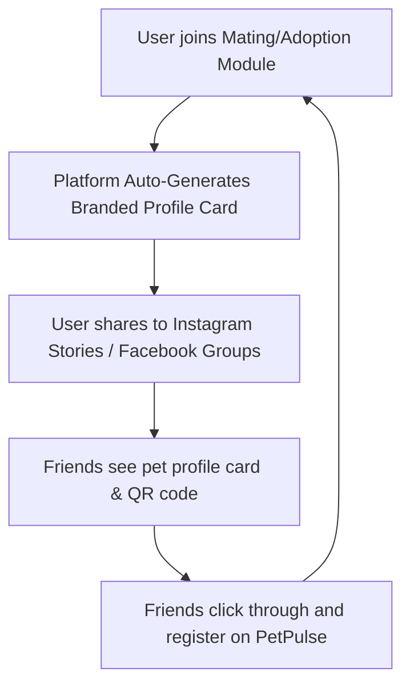

# Business Model Blueprint: PetPulse Platform

## 1. Value Proposition (B2B2C Dynamics)
PetPulse solves the fragmentation of the Egyptian pet care market through a modern, dual-sided marketplace that simultaneously serves pet owners (consumers) and pet care professionals/vendors (businesses).

```
   ┌─────────────────────────────────────────────────────────┐
   │                    PETPULSE PLATFORM                    │
   └─────────────┬─────────────────────────────┬─────────────┘
                 │                             │
   ┌─────────────▼─────────────┐ ┌─────────────▼─────────────┐
   │        FOR B2B            │ │        FOR B2C            │
   │  • Booking Automation    │ │  • Fast Agentic Triage    │
   │  • Self-Serve Ad Panel   │ │  • Unified E-Commerce     │
   │  • SaaS Practice Suite   │ │  • Verified Expert Directory│
   │  • Low-latency Messaging  │ │  • Viral Community Matching│
   └───────────────────────────┘ └───────────────────────────┘
```

---

## 2. Monetization Engines (Revenue Architecture)

### A. The Self-Serve Ad Campaign Network
Leveraging our dynamic dashboard and automated moderation flow, PetPulse provides a self-serve advertising platform for local pet businesses:
1. **Tiered Hyper-Local Placements:**
   - **Premium Placements (Home & Community Feed):** High-exposure slots priced at a premium weekly rate (**500 EGP/week**) targeted at major veterinary clinics or corporate pet food brands.
   - **Niche Placements (Marketplace & Directories):** Targeted slots (**150 EGP/week**) allowing boutique dog groomers, behavior trainers, or localized breeders to capture users actively looking to hire or buy.
2. **Promoted Listings:** Sponsors can pay a visibility fee to pin their products or veterinary services to the top of category search results.

### B. "SaaS + Commission" for Care Professionals
For veterinarians and pet trainers, PetPulse provides a unified operations portal:
1. **Premium Tier ("PetPulse Pro" - 199 EGP/month):**
   - **Verified Badge:** Direct organic profile boost in directory listings.
   - **Practice Management Suite:** Access to secure, persistent digital medical record logs and customized behavioral training plan builders.
   - **Client Retention tools:** Automated SMS/WhatsApp appointment reminders (reducing client no-shows by up to 35%).
2. **Booking Commission:** PetPulse processes bookings through a secure single-transaction check-out gateway, collecting a **5% to 8% processing fee** per completed consultation or training session.

### C. Vendor & Petshop Storefront Licensing
A scalable listing model for commercial retailers on the B2B2C marketplace:
- **Starter Tier (Free):** Up to 10 product listings, standard check-out gateway access.
- **Pro Shop Tier (350 EGP/month):** Unlimited catalogs, advanced merchant analytics dashboards (sales, visits, top products), direct live customer messaging integration, and inclusion in platform-wide marketing campaigns.

---

## 3. Organic Growth Loops (Low CAC Acquisition)

To minimize paid marketing spend, PetPulse uses viral, emotionally-driven growth loops built directly into key community modules:



### Loop 1: Branded Pet Mating Resumes (Emotional Social Loop)
- **The Hook:** When pet owners create a match profile for mating, the system compiles their photos and pedigree into a high-design, modern **"Pet ID / Mating Resume Card"**.
- **The Engine:** This card features a dynamic QR code and a direct CTA: *"Find my pet's perfect match on PetPulse!"*
- **The Loop:** Owners share these visually premium cards to Instagram Stories, Pet Facebook Groups, and WhatsApp chat groups. Clicking the link takes friends directly into the PetPulse matchmaking feed, prompting new sign-ups.

### Loop 2: Adoption Board Social Campaign Generator (Goodwill Loop)
- **The Hook:** Individual rescuers and shelter admins upload animals looking for a home.
- **The Engine:** The system generates emotional, highly engaging ad-style templates optimized for social feeds, showing medical verification status and key behaviors.
- **The Loop:** Shared dynamically by volunteers and local communities, driving high-volume organic inbound web traffic while lowering platform Customer Acquisition Cost (CAC) to near-zero.

---

## 4. Egypt-Centric Bootstrapping Plan (Zero-Budget Launch)

### Phase 1: Onboard Anchor Providers (Cairo/Giza Focus)
- **Action:** Select and onboard the top 50 high-reputation Cairo veterinary clinics and 30 active local dog trainers.
- **Incentive:** Offer a **12-month free license** of *PetPulse Pro* with zero setup fees.
- **Value Loop:** In return, providers direct their existing patients and clients to book appointments via PetPulse, immediately seeding the directory with active, high-intent users.

### Phase 2: Localized Community Infiltration
- **Action:** Target dense regional pet groups (e.g., *Maadi Dogs*, *Sheikh Zayed Pet Owners*) with low-cost social contests: *"Submit your pet for PetPulse Pet of the Month"*.
- **Incentive:** The winning pet receives a free premium veterinary consultation at an anchor partner clinic.
- **Value Loop:** Voting requires landing page registration, driving thousands of localized sign-ups at minimal cost.

---

## 5. Monthly Revenue Projections (Cairo Initial Launch)

Based on a conservative estimate of 10,000 active users in the greater Cairo region within the first 6-12 months of launch:

| Revenue Channel | Volume / Metric | Unit Price (EGP) | Monthly Revenue (EGP) |
| :--- | :--- | :--- | :--- |
| **Vet/Trainer SaaS Pro** | 100 Active Premium Profiles | 199 / month | 19,900 EGP |
| **Booking Commission Fee** | 800 Bookings / mo (Avg. ticket 300 EGP @ 6%) | 18 / booking | 14,400 EGP |
| **Vendor Subscriptions** | 40 Premium Pro Shops | 350 / month | 14,000 EGP |
| **Self-Serve Banner Ads** | 12 campaigns running per week | 350 / week (avg) | 16,800 EGP |
| **ESTIMATED MONTHLY REVENUE**| | | **65,100 EGP** |

> [!NOTE]
> *Gross Profit Margins remain exceptionally high (>88%) due to cloud database efficiencies (Supabase Serverless) and self-serve ad system automation requiring minimal manual administration.*
