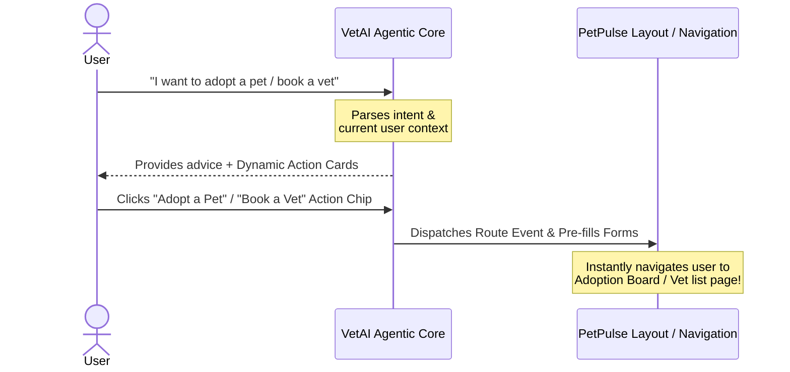
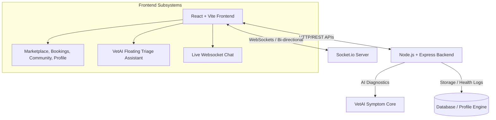

# 🐾 PetPulse — Integrated Pet Care, Commerce, & Social Ecosystem (Driven by Agentic AI)

[](https://react.dev)
[](https://vite.dev)
[](https://tailwindcss.com)
[](https://socket.io)
[](LICENSE)

Welcome to **PetPulse**, a state-of-the-art, comprehensive digital hub designed to redefine how pet owners connect, consult, and shop. Engineered as a high-impact graduation project, PetPulse stands out by consolidating a **fully integrated Agentic AI Copilot (VetAI)**, a complete e-commerce marketplace, live booking systems for vets & trainers, social community match-making, real-time messaging, and a gamified loyalty reward engine into a singular unified, fully-responsive dashboard.

---

## 🤖 The Agentic AI Copilot Core (The Ultimate Competitive Edge)

What makes PetPulse unique is **VetAI**—our **Agentic AI Assistant**. Unlike standard question-answering bots, VetAI behaves as a **context-aware virtual companion and navigator** capable of driving action, guiding user workflows, and automating complex tasks across all subsystems:



*   **⚡ Task Automation & Guidance**: VetAI parses human language intents (e.g., "I need to buy food", "my dog has a fever", "I want to adopt a puppy") and dynamically generates **interactive action cards and chips** (e.g. `Book a Vet`, `Check Symptoms`, `Adopt a Pet`). Clicking these chips serves as agentic callbacks that trigger routing changes and navigate the user instantly to the relevant section.
*   **🩺 Real-Time Symptom Pre-Screening**: VetAI collects physiological details from the user, evaluates symptom urgency, and flags critical emergency cases before dynamically directing the owner to local verified vets.
*   **💡 Cross-Domain Context Mapping**: VetAI bridges the gap between commerce, booking, and community. It suggests local trainers or vets based on triage inputs, links products in the marketplace to pet conditions, and automatically coordinates alerts.

---

## 🌟 Core Value Propositions

PetPulse represents a paradigm shift in pet care by bridging isolated services into a cohesive, interactive environment:

1. **🤖 VetAI Agentic Copilot**: Context-aware digital copilot that automates bookings via Function Calling, schedules clinic slots, and employs a custom viewport observer to eliminate form overlaps on mobile.
2. **🛒 Premium E-Commerce Marketplace**: Fully integrated shop showcasing premium foods, accessories, and clinical supplies with a cart sliding drawer and custom step checkout.
3. **🤝 Connections & Networking Dashboard**: Strict role-isolated connections counter. Standard users, vets, and trainers displays accepted connectors count, while business/vendor profiles have communication features deactivated. Unaccepted requests filter into a secure "Spam" folder.
4. **📅 Spherical Geocentered Booking**: Instantly filters nearby certified clinics and training academies via spherical trigonometry (Haversine formula), panning maps dynamically using MapRecenter views.
5. **🎭 Hover-Persistent Comments Reactions**: Curated reactions panel supporting 👍, ❤️, 😂, 😮, 😢, and 😡. Features micro-interaction persistence guards that prevent overlay collapse during selection.
6. **💬 Socket-Enabled Messages**: Decoupled, responsive two-column real-time messaging pipeline that supports smooth transition sliders on small mobile viewports.
7. **🎁 PulseBox Loyalty Loop**: Points are programmatically computed on database transactions (adoptions, shopping, booking) to be redeemed for veterinary coupons and shop deals.

---

## 🏗️ System Architecture

PetPulse utilizes a modern, decoupled client-server architecture built for speed, responsiveness, and scale:



---

## 🛠️ Technology Stack

| Layer | Technologies | Key Role |
| :--- | :--- | :--- |
| **Frontend** | React 19, Vite 8, Tailwind CSS | High-performance client, custom component styling, and fast Hot Module Replacement (HMR). |
| **Routing** | React Router Dom v7 | Client-side routing with route protection and transitions. |
| **Real-time** | Socket.io-client | Bi-directional messaging, status broadcasts, and notification updates. |
| **AI Integration** | Axios | RESTful connection to backend VetAI symptom analyzers. |
| **Mapping** | Leaflet, React Leaflet | Geographical visualization of lost & found pets and local clinics. |
| **Alerts** | React Hot Toast | Beautiful, dynamic non-blocking toast notifications. |

---

## 🚀 Getting Started

Follow these steps to run the client workspace locally:

### 1. Prerequisites
Ensure you have **Node.js** (v18.0.0 or higher) and **npm** installed.

### 2. Installation
Clone the repository, navigate to the web directory, and install dependencies:
```bash
# Navigate to web directory
cd petpulse-web

# Install client packages
npm install
```

### 3. Run Development Server
Start the local Vite development server:
```bash
npm run dev
```
The client will start running at `http://localhost:5173`.

### 4. Build for Production
Generate a highly-optimized, minified client bundle ready for deployment:
```bash
npm run build
```

---

## 📂 Project Structure

```text
petpulse-web/
├── public/                 # Static assets and icons
├── src/
│   ├── assets/             # Brand logos and illustration assets
│   ├── components/         # Reusable structural components
│   │   ├── layout/         # Layout wraps (Navbar, DiscoverySidebar, MainLayout)
│   │   ├── community/      # Specialized community sub-elements
│   │   └── Chatbot.jsx     # VetAI floating chatbot component
│   ├── context/            # Global contexts (AuthContext, ThemeContext)
│   ├── pages/              # High-level route pages
│   │   ├── community/      # Community tabs (FeedTab, PetMatchTab, AdoptionsTab)
│   │   └── Messages.jsx    # Real-time WebSocket messaging dashboard
│   ├── App.jsx             # Route definitions and layouts
│   ├── index.css           # Global typography and Tailwind imports
│   └── main.jsx            # React root registration
├── index.html              # HTML shell template
├── package.json            # Scripts and packages manifest
└── vite.config.js          # Vite compiler configurations
```

---

## 🎓 Academic Presentation Tips

When presenting PetPulse to the graduation review panel, highlight the following features:
* **The Agentic AI Core:** Show how the chatbot doesn't just display static text, but serves as a fully responsive companion that executes routing commands, changes views, and assists workflows based on conversational queries.
* **The Unified Loyalty Loop:** Demonstrate how purchasing items in the *Marketplace* awards points that show up in *PulseBox*, showing clear cross-domain design logic.
* **Mobile-First Responsiveness:** Showcase the smooth navigation drawer, responsive chatbot overlay-hiding, and the column-sliding message UI on mobile emulators.
